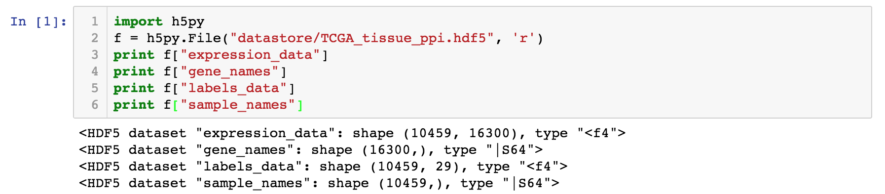

# Gene Expression Convolutions

### Francis Dutil*, Joseph Paul Cohen*, Martin Weiss, Georgy Derevyanko, Yoshua Bengio

This is a research codebase developed to incorporate gene interaction graphs as a prior for neural networks. With it, you can load a gene expression dataset like The Cancer Genome Atlas (TCGA) and a gene interaction graph like GeneMania, then instantiate a Graph Convolutional Neural Network using the structure of the gene interaction graph and train it on your gene expression data.

There are two notebooks in the repository called fig-4.ipynb and fig-5.ipynb. Within them you will find a training loop that generates figures 4 and 5 from \url{https://arxiv.org/pdf/1806.06975.pdf} {our paper} published at the Workshop on Computational Biology at ICML 2018. I would recommend starting there.

You will see that the interface to our library is simple (like SKLearn with fit and predict functions) and extensible. To use your own gene dataset, you will need to format it as an HDF5 file like this:

Additionally, you'll need a gene interaction graph to construct your Graph Convolutional Network. Its format should be:

Once you've done this, you can instantiate your gene graph:
`gene_graph = GeneInteractionGraph(graph_path)`
This will load your graph into a dataframe labelled with the gene names, and turn that into a NetworkX graph.

You can also load in your dataset like this: 

`dataset = datasets.GeneDataset(file_path="datastore/TCGA_tissue_ppi.hdf5")`

Now you're ready to use our models!

If you look in `models/model_wrapper.py` you will find a class called WrappedModel. This class provides a nice interface to our graph convolution code (which is in `models/model_layers.py` and `models/graph_layers.py`). 

We instantiate our graph convolutional model like this:

`gcn = WrappedModel(name="GCN_lay20_chan32_emb32_dropout", cuda=True, num_layer=4, channels=32, embedding=32, prepool_extralayers=5, pooling="ignore")`

Then we can train it like this:

`gcn.fit(X_train, y_train, adj=neighborhood)`

where `X` is (all or part of) your gene expression dataset, `y` are your labels for those samples, and `neighborhood` is a NetworkX graph containing the genes in `X`.

And use it like this:

`y_hat = gcn.predict(X_test, y_test)`

And that's about it! We're excited about this project, available to support it, and will continue development. Don't hesitate to reach out by email.
