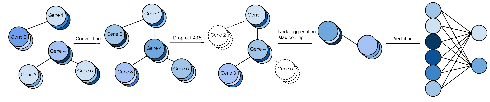

# Gene Graph Convolutions

### Francis Dutil*, Joseph Paul Cohen*, Martin Weiss, Georgy Derevyanko, Yoshua Bengio

**NB** : There is now a separate repository for the paper **Analysis of Gene Interaction Graphs as Prior Knowledge for Machine Learning Models** : [gene-graph-analysis](https://github.com/Bertinus/gene-graph-analysis)

This is a research codebase developed to incorporate gene interaction graphs as a prior for neural networks. With it, you can load a gene expression dataset like The Cancer Genome Atlas (TCGA) and a gene interaction graph like GeneMania, then instantiate a Graph Convolutional Neural Network using the structure of the gene interaction graph and train it on your gene expression data. The pipeline looks like this:



There are two notebooks in the repository called fig-4.ipynb and fig-5.ipynb. Within them you will find a training loop that generates figures 4 and 5 from [our paper](https://arxiv.org/pdf/1806.06975.pdf) published at the Workshop on Computational Biology at ICML 2018. I would recommend starting there.

**NB** Currently under development in the interest of supporting larger gene graphs and datasets.

You will see that the interface to our models is simple (like SKLearn with fit and predict functions) and extensible. The gene graph and dataset loaders are pretty simple too. 

Let's start by loading your gene expression dataset. Here's an abstract class stored in `data/datasets.py`. You're going to want to subclass it and implement the load_data method and the `__getitem__` method.

```class GeneDataset(Dataset):
    """Gene Expression Dataset."""
    def __init__(self):
        self.load_data()

    def load_data(self):
        raise NotImplementedError()

    def __getitem__(self, idx):
        raise NotImplementedError()
```

There are a few important attributes your dataset class will want to set in the load_data method. The most important ones are a pandas dataframe, `df` with genes as columns (with gene names as column names) and patient samples as rows. Your dataset should also have a labels attribute with a label for each row in `df`. Finally, a data attribute should contain the same data as your `df`, but in the form of a numpy array. If you are confused, look at the `TCGADataset` that we load in our notebooks for an example. As for the `__getitem__` function on your dataset, it just returns samples of this form: `{'sample': sample, 'labels': label}`.

Additionally, you'll need a gene interaction graph to construct your Graph Convolutional Network. These live in `data/gene_graphs.py`. Its format should be:
```
class GeneInteractionGraph(object):
    """ This class manages the data pertaining to the relationships between genes.
        It has an nx_graph, and some helper functions.
    """
    def __init__(self):
        self.load_data()

    def load_data(self):
        raise NotImplementedError

    def first_degree(self, gene):
      ...
    
    def first_degree(self, gene):
      ...
```

Again, you'll want to subclass the `GeneInteractionGraph` and implement the `load_data` method. The 3 key attributes of your graph are: `node_names` which contain the names of your genes, `df` which is a pandas dataframe containing your adjacency matrix with node_names set as column names and the index, and `nx_graph` which is a networkx object created from the dataframe.

Now you're ready to use our models!

If you look in `models/models.py` you will find a class called Model. This class provides a nice interface to our graph convolution models, baseline, and train loop. You'll also see a utils file that we use for graph clustering and constructing our models.

We instantiate our graph convolutional model like this:

`gcn = GCN(name="GCN_lay4_chan32_emb32_dropout", cuda=True, num_layer=4, channels=32, embedding=32, dropout=True)`

Then we can train it like this:

`gcn.fit(X_train, y_train, adj=neighborhood)`

where `X` is (all or part of) your gene expression dataset, `y` are your labels for those samples, and `neighborhood` is a NetworkX graph containing the genes in `X`.

Then simply evaluate your model

`y_hat = gcn.predict(X_test, y_test)`

And that's about it!  We're excited about this project, available to support it, and will continue development. Don't hesitate to reach out by email.
